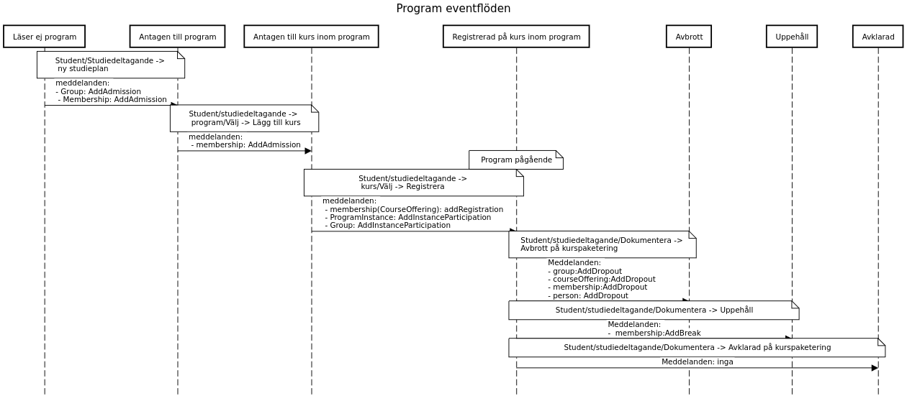

## Event flow

This is the event flows of Program, aka kurspaketering, in Ladok.
The titles of each columns are the states. The notes describe how the events can be triggered in Ladok, and the messages that are produced are displayed in the actions arrows.
[Event flow program](https://sequencediagram.org/index.html#initialData=C4S2BsFMAIAUCcD2BzeBDAttSA3SA7YAM3ADeATAgKAOHgE8BnABzQGMR9loAGAOgAsVfImAxEeeNAAyAE8aQpkAFbRmSVJgA00AIKE0yAtFDhwajegwAuaAGVgAV0qEA9A+chIlcMENp8SmgAWgA+aAAdfGh8emhGJ3IvZnAAqio5BSVVdRQrEPD9PyNo03NczRtoDG8fAJdbKOC4S0xbXXJyDowQRkYQRHxhUXFJPQMSkxAzCzztceLjMugAa0d4RmhORCwKq1sPF2BXBM9vSF9-QJgwyOi9zFcANVlwVVu5ZG5ltY2qIsMS2m5VaWFuAMmP3Wm22u1BthqnQu9QIjWizQA0tD2p1ur1+oNhmJoBJFNAAEqQZC9OiKNDkNQAU9W0K2IjhcyqCE5TOQjIIlCJozJEKBM1+MPZs0qOkp1IS8DpDOYzIlbJ20v29kStBOiS8PmKKIKdxZG2er3e4TlNMV6H+EzF5jVsM1mBNNoVSqZZslGoeVURdWu+DRIV9tnp5E9dDQoEGpua3MqAEl8AkAmxIDjyGmM-gs7A0PBQBxWPHolFwwBxJCOZg5vN+AuQIslkBluMDIZCkljGN2+k+l1SgM6XQ4ABGSGAwFsABFEGsaoQ6e0pzPgMPoawVpAxPBOMgqAPvSrfeqOZVwRvRHPoABZWrIkNo5qoRD16wdcjzpDMT8tyaaA2E-DZIAAeSIIhFCPb9Oj-RAAMcID8GaGoMEnRRGAACxABsf0Q5DUOaZhsMGHMiMA3tSSkU90GVVVWVdMdoAAVWYMicMZMwFyXRwVwPNBbA4riePAE8qVtM8mI2S83QwW5RMgbjeMfZ9UlfO5mmqSBMOwvCCM6AAhRU0BWGj+ykr0GO3OSWNBcccBWVIGL45daDXPRnNcodzwlXd91grhJPlWlbP85jR1BG8XOLelbCfJFNIacMMKwjZDJzABhHYUiC8hcuhVt2BWQEm0zSAgA)

